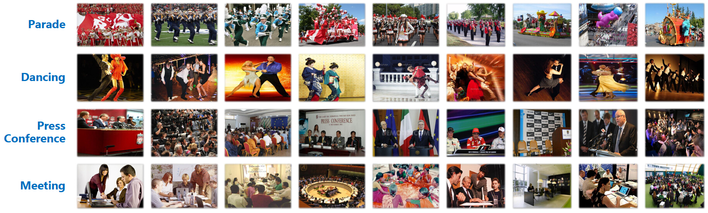
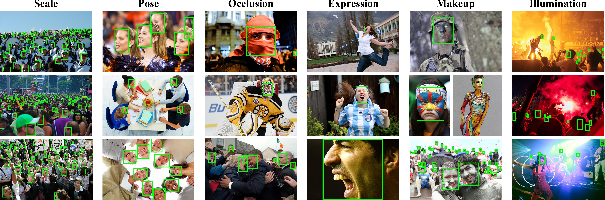
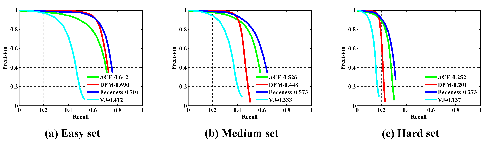
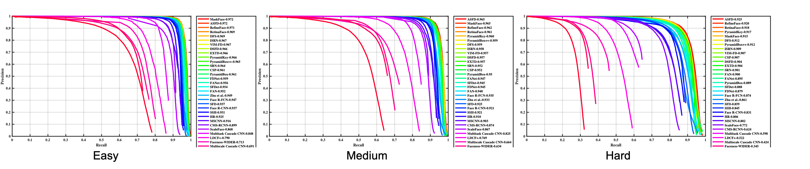

## What is WIDER? WIDER 数据集

WIDER (Web Image Dataset for Event Recognition), 由香港中文大学多媒体实验室整理收集。 

WIDER is a dataset for complex event recognition from static images. As of v0.1, it contains 61 event categories and around 50574 images annotated with event class labels. We provide a split of 50% for training and 50% for testing.

WIDER是一个用于从静态图像中识别复杂事件的数据集。从v0.1开始，它包含61个事件类别和大约50574个带有事件类标签的图像。拆分50%用于训练，50%用于测试。

<!--more-->

### 案例图片

### 官方地址

http://yjxiong.me/event_recog/WIDER/

## WIDER FACE 数据集

WIDER FACE dataset is a face detection benchmark dataset, of which images are selected from the publicly available WIDER dataset. We choose 32,203 images and label 393,703 faces with a high degree of variability in scale, pose and occlusion as depicted in the sample images. WIDER FACE dataset is organized based on 61 event classes. For each event class, we randomly select 40%/10%/50% data as training, validation and testing sets. We adopt the same evaluation metric employed in the PASCAL VOC dataset. Similar to MALF and Caltech datasets, we do not release bounding box ground truth for the test images. Users are required to submit final prediction files, which we shall proceed to evaluate.

WIDER FACE 数据集是一个人脸检测基准数据集，是从公开的 WIDER 数据集中选取。选择了32203张图片，并标注了393703张在比例、姿势和遮挡方面具有高度可变性的人脸。WIDER FACE 数据集选择了61个事件类，对于每个事件类，我们选择40%/10%/50%的数据作为训练、验证和测试集。检测算法在测试集上的评估方式与PASCAL VOC DATADASET 相同。

## 下载地址 

[http://shuoyang1213.me/WIDERFACE/](http://shuoyang1213.me/WIDERFACE/)

## 基准

* For details on the evaluation scheme please refer to the technical report.  [WIDER FACE: A Face Detection Benchmark](http://arxiv.org/abs/1511.06523)
* For detection resutls please refer to the result page. [WIDER FACE: Results](http://shuoyang1213.me/WIDERFACE/WiderFace_Results.html)

**Scenario-Ext**: A face detector is trained using any external data, and tested on the WIDER FACE test partition.

**Scenario-Int**: A face detector is trained using WIDER FACE training/validation partitions, and tested on WIDER FACE test partition.

