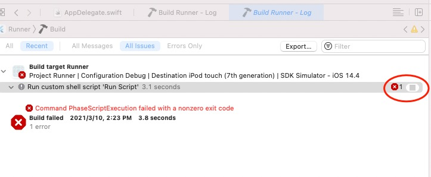
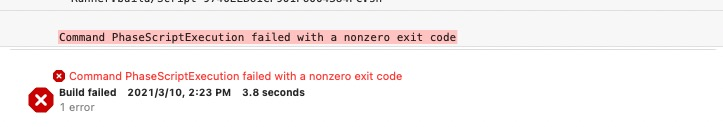
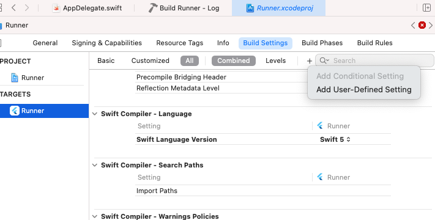
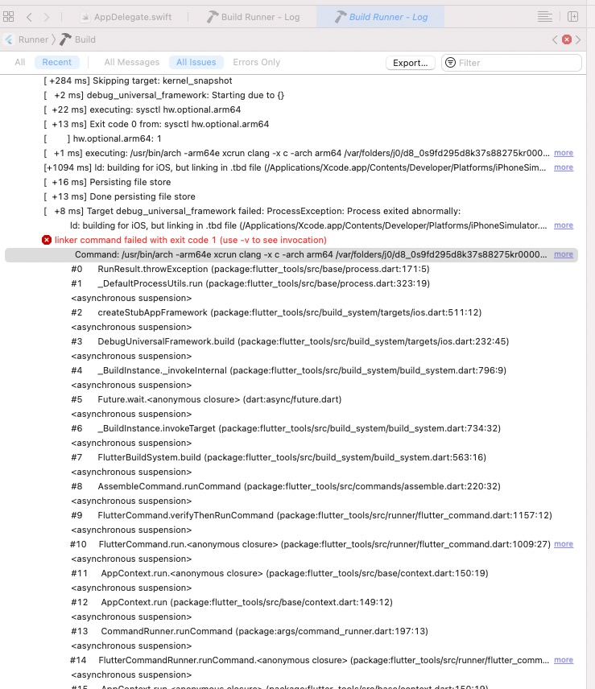

Flutter 创建项目后，Xcode编译项目时的几个问题解决。


## 环境

flutter doctor

```
[✓] Flutter (Channel stable, 2.0.0, on macOS 11.2.3 20D91 darwin-arm, locale en-CN)
[✓] Android toolchain - develop for Android devices (Android SDK version 30.0.2)
[✓] Xcode - develop for iOS and macOS
[✓] Chrome - develop for the web
[✓] Android Studio (version 4.1)
[✓] VS Code (version 1.54.1)
[✓] Connected device (2 available)

• No issues found!

```

<!--more-->

打开 flutter_project_path/ios/Runner.xcworkspace , Build.

## 错误 1. Command PhaseScriptExecution failed with a nonzero exit code

该错误信息来自Build Phases -> Run Script . 显示了错误，但未提示具体的错误信息。 需要显示错误提示。





增加 --verbose 选项。

通过查看 "$FLUTTER_ROOT/packages/flutter_tools/bin/xcode_backend.sh" 文件,  line 153:

```
 local verbose_flag=""
  if [[ -n "$VERBOSE_SCRIPT_LOGGING" ]]; then
    verbose_flag="--verbose"
  fi
```

得到可增加 verbose 选项配置。 Build Settings ->  Add User-Defined Setting . 



添加： VERBOSE_SCRIPT_LOGGING 1 。 


再次 Build，可以获得具体的错误信息。 


##  错误 2. ld: building for iOS, but linking in .tbd file


```

Showing Recent Issues
ld: building for iOS, but linking in .tbd file (/Applications/Xcode.app/Contents/Developer/Platforms/iPhoneSimulator.platform/Developer/SDKs/iPhoneSimulator14.4.sdk/usr/lib/libSystem.tbd) built for iOS Simulator, file '/Applications/Xcode.app/Contents/Developer/Platforms/iPhoneSimulator.platform/Developer/SDKs/iPhoneSimulator14.4.sdk/usr/lib/libSystem.tbd' for architecture arm64


```


这个错误的原因是 Flutter 暂时不支持 arm64 iOS 模拟器。Macbook Pro M1 等使用 arm cpu的 设备（Apple Silicon）都需要进行设置， 排除 arm64 模拟器架构。


参考 Flutter 官方文档， 
https://flutter.dev/docs/development/add-to-app/ios/project-setup

```
Flutter does not yet support arm64 iOS simulators. To run your host app on an Apple Silicon Mac, exclude arm64 from the simulator architectures.

In your host app target, find the Excluded Architectures (EXCLUDED_ARCHS) build setting. Click the right arrow disclosure indicator icon to expand the available build configurations. Hover over Debug and click the plus icon. Change Any SDK to Any iOS Simulator SDK. Add arm64 to the build settings value.

```


## Success

编译通过 正常执行调试 
