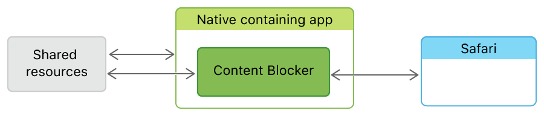
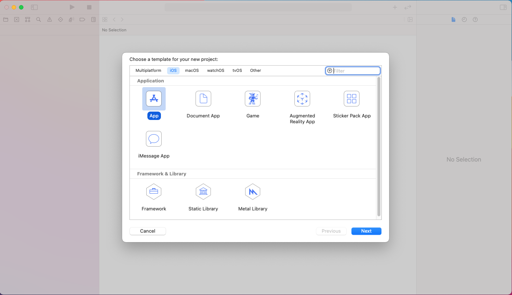
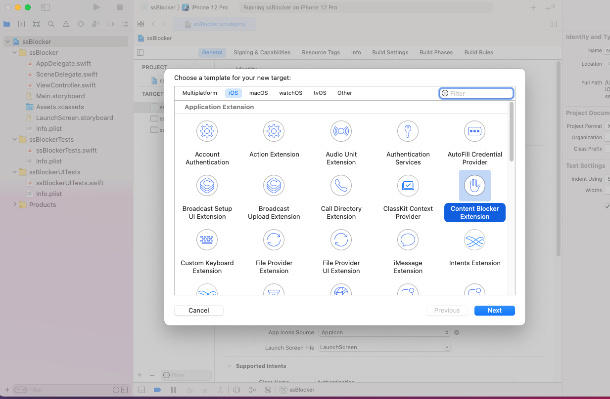
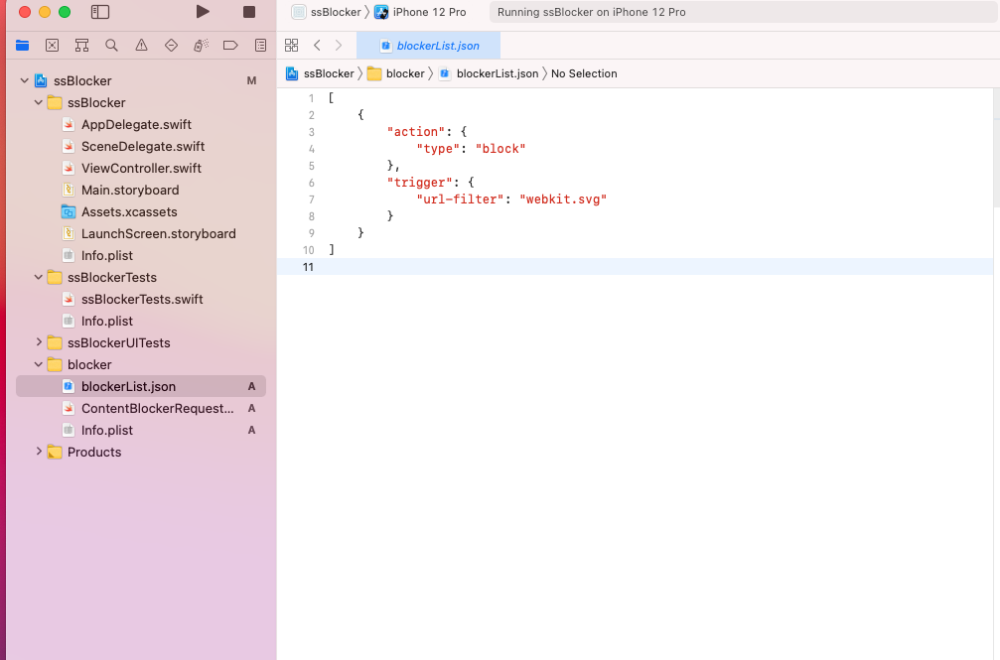
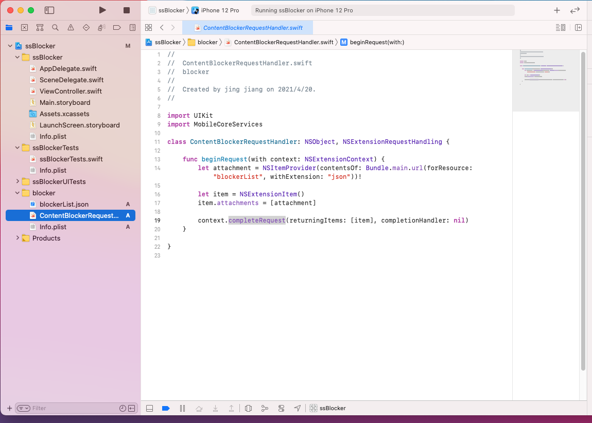

## App Extensions

App extensions let you extend custom functionality and content beyond your app and make it available to users while they’re interacting with other apps or the system. For example, your app can appear as a widget on the Home screen, add new buttons in the Action sheet, offer photo filters within the Photos app, or automatically upgrade user’s accounts to use strong passwords or Sign in with Apple. Use extensions to place the power of your app wherever your users need it most.

[https://developer.apple.com/app-extensions/](https://developer.apple.com/app-extensions/)

## Content Blocker Extension

Content Blockers are app extensions that you build using Xcode. They indicate to Safari a set of rules to use to block content in the browser window. Blocking behaviors include hiding elements, blocking loads, and stripping cookies from Safari requests.

You use a containing app to contain and deliver a Content Blocker on the App Store. The containing app defines the context provided to the extension and initiates the extension life cycle by sending a request in response to a user action.

When the Content Blocker is launched, it communicates with its containing app through a set of shared resources, and it communicates directly with Safari.

Apps tell Safari in advance what kinds of content to block. Because Safari doesn't have to consult with the app during loading, and because Xcode compiles Content Blockers into bytecode, this model runs efficiently. Additionally, Content Blockers have no knowledge of users' history or the websites they visit.

[https://developer.apple.com/documentation/safariservices/creating_a_content_blocker](https://developer.apple.com/documentation/safariservices/creating_a_content_blocker)

## 步骤 1 、 创建iOS APP

## 步骤 2 、 Content Blocker Extension

菜单 File > New > Target  选择 Content Blocker Extension.  

创建完毕后 Target 下出现两个文件：

1. blockerList.json

blockerList.json 定义了内容过滤的规则。 每个规则都是一个JSON对象，其中包含 action（操作）和 trigger（触发器字典）。 该 action 告诉 Safari 当 triggle 匹配时该怎么做。trigger（触发器）告诉 Safari 何时执行相应的操作。 Content Blockers 就是这些规则的JSON数组。

更多过滤规则看[这里](./content-blocker-filters.md)

2. ContentBlockerRequestHandler

ContentBlockerRequestHandler 实现接口 NSExtensionRequestHandling ，APP Extension 实现该接口，用于响应来自宿主 app (host app)的请求。

使用 context.completeRequest 方法告诉宿主app (host app) 请求完成，并将所需要的数据附加在数组内。数组内保存的为 NSExtensionItem .

## 步骤 3、 测试 Extension 是否生效

