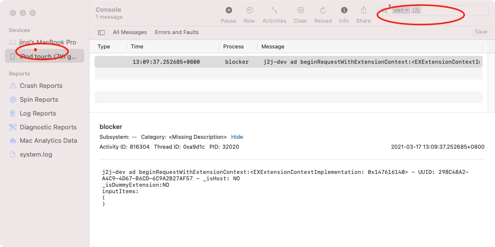

Xcode 窗口 Debug 区域显示的Log 仅显示由 Xcode 唤起进程的打印输出。 对于App Extension 工程，进程是由系统唤起的，而不是由 Xcode 。所有开发调试时无法查看到NSLog等打印的输出。

一般可以通过 Console （控制台） 程序来显示这些输出。 

<!--more-->

步骤：

1. 将 iOS 设备连接到Mac（或打开模拟器）
2. 启动 Console 程序
3. 在 Console 的左侧，选择设备（实际设别或模拟器都可以检测到）
4. 右侧查看输出。 一般输出非常多，可以使用关键字过滤。

如果使用 NSLog ， 最好在输出的日志消息中附带额外的标识字符串，这样可以过滤显示到特定类型的日志输出。 对于要求更高的App，推荐使用 OS log
 API （<os/log.h>）。 OS Log API 参考材料：[ WWDC 2016 Session 721 Unified Logging and Activity Tracing](https://developer.apple.com/videos/play/wwdc2016/721/)

 ### 参考&来源

  eskimo [https://developer.apple.com/forums/thread/106722?answerId=324725022#324725022](https://developer.apple.com/forums/thread/106722?answerId=324725022#324725022)