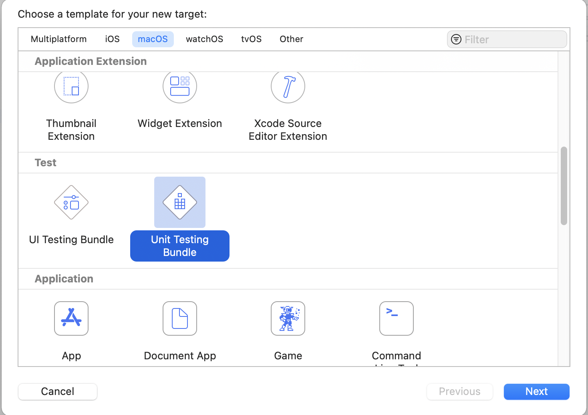
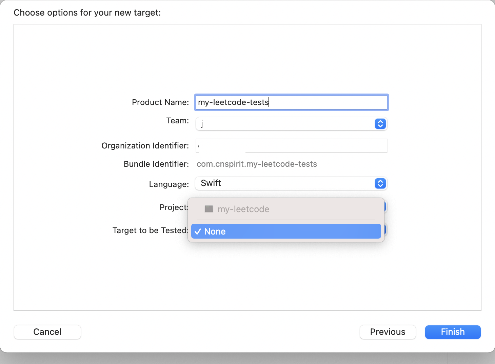
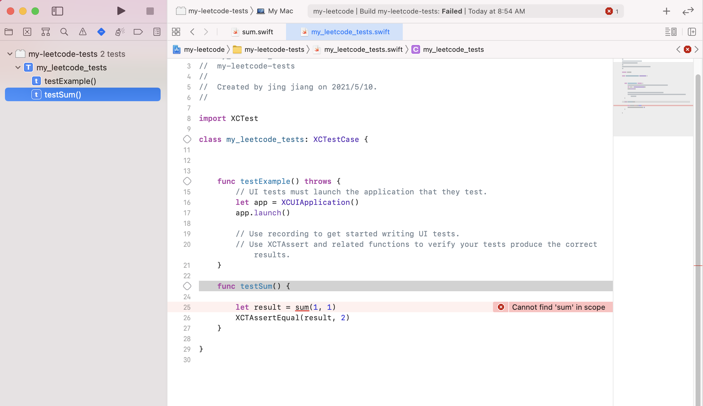
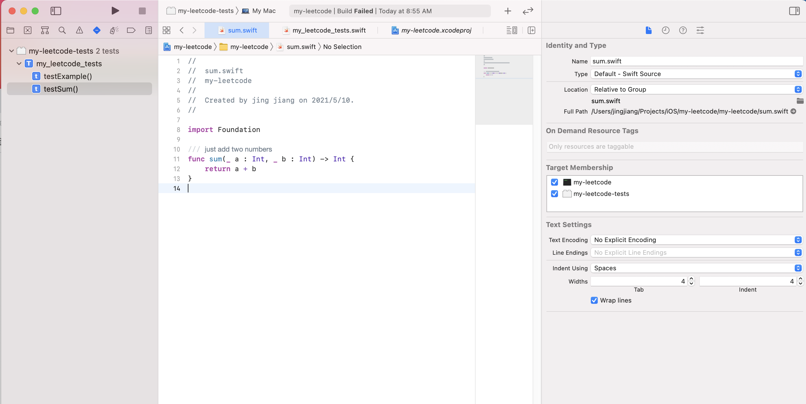
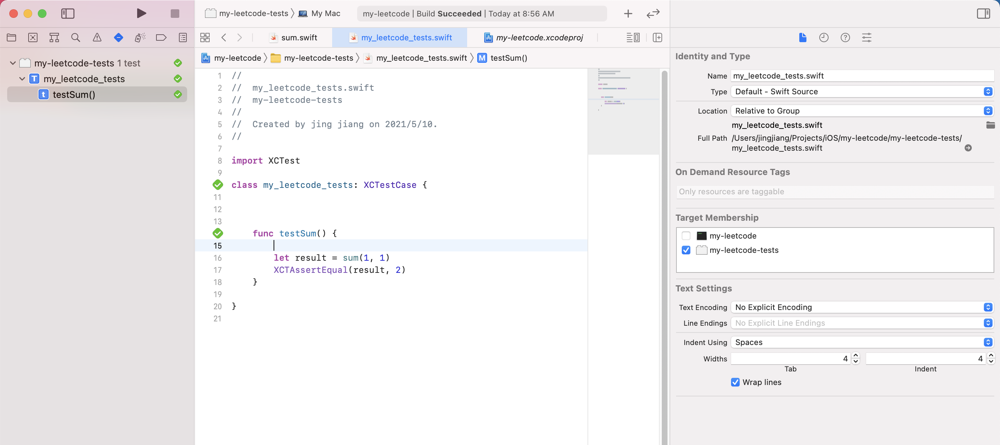
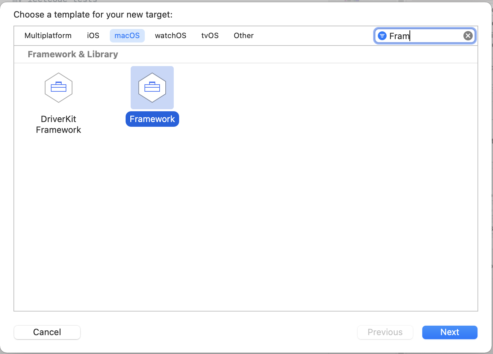
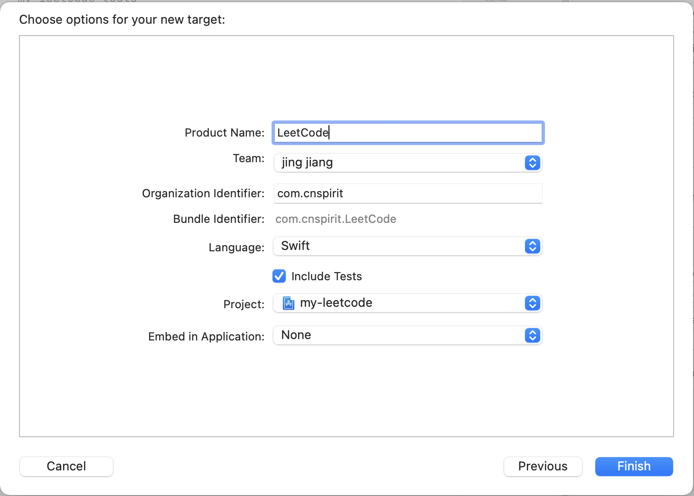
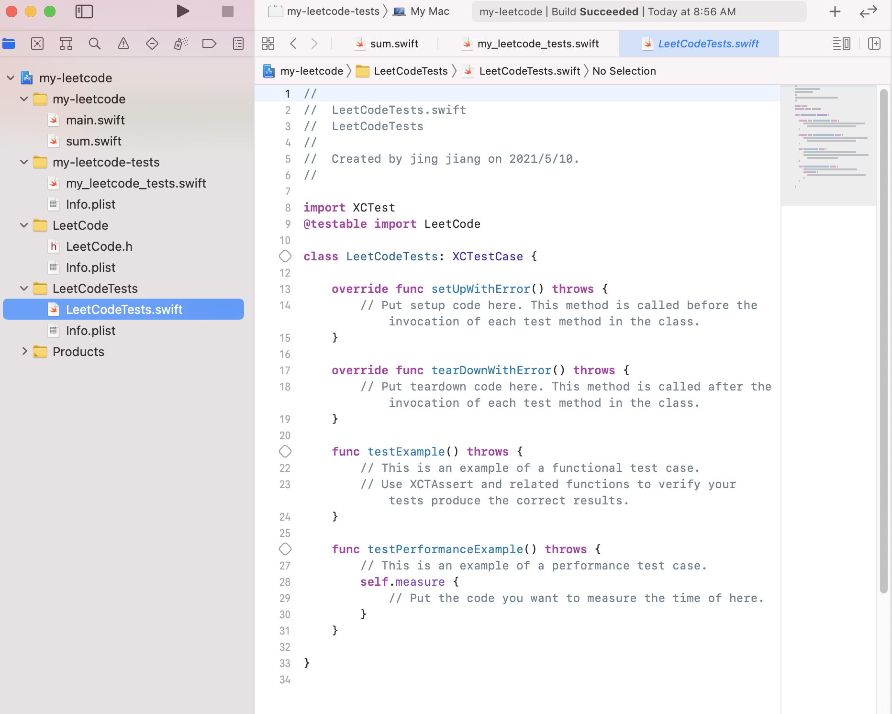
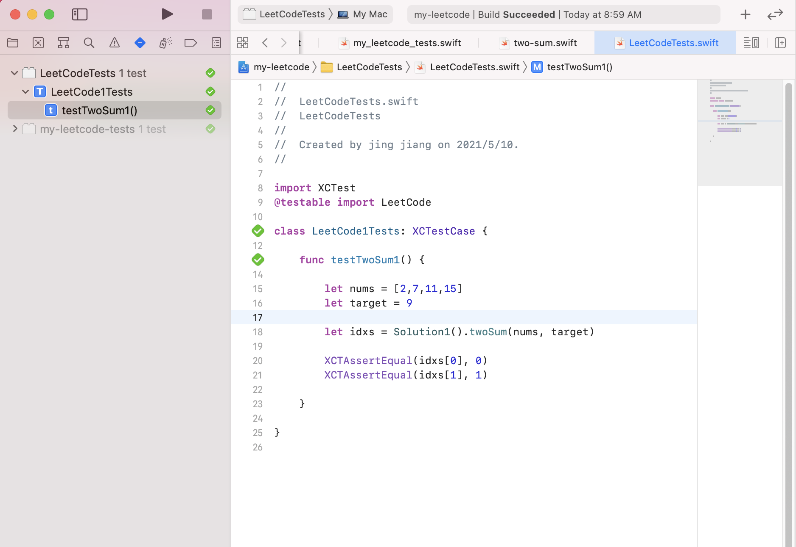

 
XCode 创建 iPhone 应用程序时, 默认会提示创建单元测试 Target 。 但是对于简单的命令行程序(Command Line Application), 并不会提示创建。 

<!--more-->

如果需要使用，仍然可以新建 Target, 类型选择 Unit Testing Bundle 。





创建时 Target to be tested 是无法选择的。

```
Yes, you can add the unit testing bundle, but it won't let you set Target to be Tested. So, you won't be able to call into your main target (as far as I can tell). I'm not sure what that bundle is good for without a test target.
 

-- by sharp11

```

```
Right.  That’s because the machinery to load your test bundle within a process only works if the process is based on a GUI framework (like Cocoa or Cocoa Touch).  A command line tool typically does not use a GUI framework and thus the test machinery is unable to load your bundle into that tool.

However, you can test without an app target.  If you set the Target to be Tested popup to None, Xcode will load your test bundle into its built-in ‘test runner’ tool, 

xctest

This works well for most but there are some gotchas.  Specifically, if the code you’re using requires entitlements then you won’t be able to test it like this because there’s no way to give those entitlements to 

xctest

 The standard workaround for that is to add a dummy test target app to your project.
Share and Enjoy — Quinn “The Eskimo!” Apple Developer Relations, Developer Technical Support, Core OS/Hardware 


-- by eskimo 

```

 使用时可用如下两种方式：


## 1. 设置主工程内的文件 Target Membership


新建测试代码 sum.swift :

```
/// just add two numbers 
func sum(_ a : Int, _ b : Int) -> Int {
    return a + b
}

```

按如上步骤新建 Unit Testing Bundle 后, 新建测试用例:

```
import XCTest

class my_leetcode_tests: XCTestCase {

    

    func testSum() {
        
        let result = sum(1, 1)
        XCTAssertEqual(result, 2)
    }
     
}


```

执行报错:



设置文件的Target Membership, 加入到单元测试 Target中, 后重新执行:






## 2. 新建 Framework Target



此时直接提示 创建单元测试 (include tests)



创建后的文件结构：




在 Framework Target 下创建文件:

```

class Solution1 {
    
    func twoSum(_ nums: [Int], _ target: Int) -> [Int] {
        for i in 0..<nums.count {
            for j in i+1..<nums.count {
                if target == nums[i] + nums[j] {
                    return [i,j]
                }
            }
        }

        return [Int]()
    }
}

```

编写单元测试

```
import XCTest
@testable import LeetCode

class LeetCode1Tests: XCTestCase {
    
    func testTwoSum1() {
        
        let nums = [2,7,11,15]
        let target = 9
        
        let idxs = Solution1().twoSum(nums, target)
        
        XCTAssertEqual(idxs[0], 0)
        XCTAssertEqual(idxs[1], 1)
        
    }
    
}


```

执行：




## 参考

https://developer.apple.com/forums/thread/52211