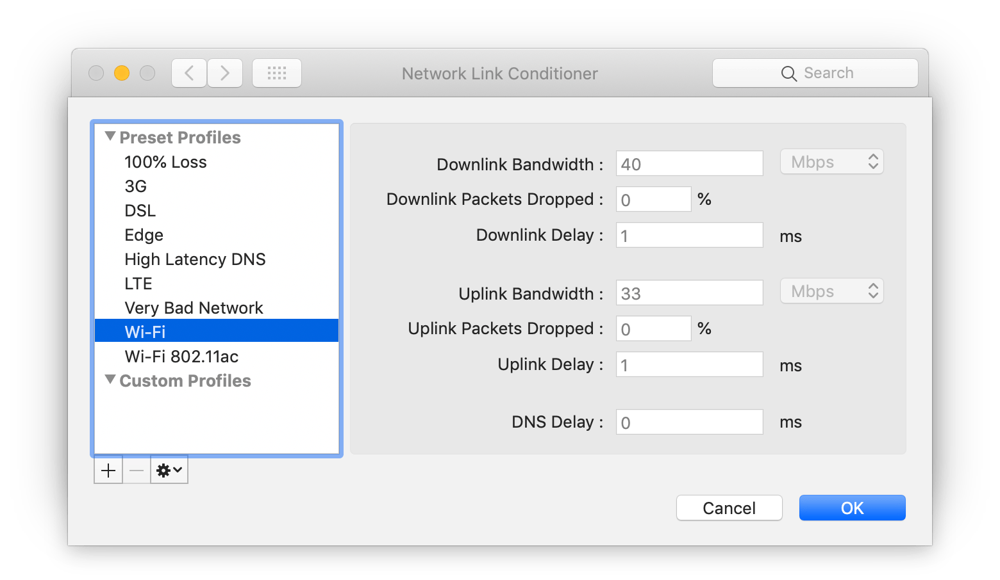

因为网络共享，看视频或下载的时候会占用大量带宽，导致网络卡顿，影响他人的使用。速度太快还会被网管断开连接(下载Xcode或更新时经常出现)。下面是搜索到的两种限制网速的方式。苹果官方提供了限制系统整体网速的Network Link Conditioner 和 OpenBSD's Packet Filter 命令行工具。
<!--more-->


## 方法1 使用Network Link Conditioner

通过Addtional Toos for Xcode中的Network Link Conditioner（网络链接调节器）实现网络速度控制。

### 安装步骤：

1. 安装Xcode
2. 安装Addtional Toos for Xcode ，下载地址[https://developer.apple.com/download/more/?=for%20Xcode](https://developer.apple.com/download/more/?=for%20Xcode), 或者通过菜单Xcode -> Open Developer Tool -> More Developer Tools 打开浏览器后搜索Addtional Toos for Xcode下载


3. 打开Additional_Tools_for_Xcode -> Hardware -> Network Link Conditioner.prefPane 


 
首次安装Network Link Conditioner 后，使用正常。当关闭并再次打开 	System Preferences，Network Link Conditioner配置面板将消失，尝试	重新安装时后出现错误: You can't install thee "Network Link 	Conditioner" preferences.  
	
 
 
解决方法是将用户PreferencePanes目录下的Network Link Conditioner.prefPane移动至系统配置目录。在命令行中输入如下命令：
	
```
sudo mv ~/Library/PreferencePanes/Network\ Link\ Conditioner.prefPane /Library/PreferencePanes/
```
	
再次打开System Preferences，Network Link Conditioner将正常展示。

### 使用

启用Network Link Conditioner会根据所选配置更改整个系统的网络环境，从而限制上行链路或下载带宽，延迟和数据包丢失率。

默认已经有了如下预设，可以直接选择使用：

* 100% Loss
* 3G
* DSL
* EDGE
* High Latency DNS
* LTE
* Very Bad Network
* WiFi
* WiFi 802.11ac



也可以自行设定：


启用后系统网络限制生效。


## 方法2 使用PF（OpenBSD's Packet Filter）工具限制

保存以下脚本pf-bandwidth-limit.sh

```
#!/bin/bash
set -o errexit    
set -o errtrace  
set -o pipefail   
set -o posix      
#set -x          


start_limit(){

  local size_kbytes="$1"
  # Reset dummynet to default config
  dnctl -f flush

  # Compose an addendum to the default config: creates a new anchor
  (cat /etc/pf.conf && echo 'dummynet-anchor "my_anchor"' && echo 'anchor "my_anchor"') | pfctl -q -f -

# Configure the new anchor
cat <<EOF | pfctl -q -a my_anchor -f -
no dummynet quick on lo0 all
dummynet out proto tcp from any to any port 1:65535 pipe 1
EOF

  # Create the dummynet queue
  dnctl pipe 1 config bw ${size_kbytes}Kbit/s

  # Activate PF
  pfctl -E

  # to check that dnctl is properly configured: sudo dnctl list

  sudo dnctl list

}

stop_limit(){
  sudo dnctl flush
  sudo pfctl -f /etc/pf.conf
  sudo dnctl list
}

main() {
  local size_kbytes=$((512)) # 512K

  case "$1" in
    start)
      start_limit "${size_kbytes}"  
    ;;
    stop)
      stop_limit
     ;;
    *)
      echo "Usage: $0 <start|stop>"
    ;;
  esac
}

main "$@"
```

使用：
```
sudo chmod a+x ./pf-bandwidth-limit.sh

#启动速率限制
sudo ./pf-bandwidth-limit.sh start
#停止速率限制
sudo ./pf-bandwidth-limit.sh stop
```

启动后输出如下内容，表示限速成功:
```
Flushed all pipes.
pfctl: Use of -f option, could result in flushing of rules
present in the main ruleset added by the system at startup.
See /etc/pf.conf for further details.

pfctl: Use of -f option, could result in flushing of rules
present in the main ruleset added by the system at startup.
See /etc/pf.conf for further details.

No ALTQ support in kernel
ALTQ related functions disabled
pf enabled
Token : 8914907148313668449
00001: 512.000 Kbit/s    0 ms   50 sl. 0 queues (1 buckets) droptail
    mask: 0x00 0x00000000/0x0000 -> 0x00000000/0x0000
```
## 参考


* [https://nshipster.com/network-link-conditioner/](https://nshipster.com/network-link-conditioner/)
* [https://mop.koeln/blog/limiting-bandwidth-on-mac-os-x-yosemite/](https://mop.koeln/blog/limiting-bandwidth-on-mac-os-x-yosemite/)
* [https://thesmithfam.org/blog/2012/04/11/throttling-your-network-connection-on-mac-os-x/](https://thesmithfam.org/blog/2012/04/11/throttling-your-network-connection-on-mac-os-x/)
