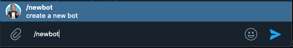

## bot 可以用来做什么

参考官方的bot介绍， bot可以做很多事情

- 消息提醒、新闻通知
- 使用第三方的内容增强聊天 集成服务 ( Gmail、GIF bot、IMDB bot...)
- 接收付款
- 创建工具服务
- 游戏
- 社交服务
- 等等

## 1. 创建bot

在telegram 客户端中发起与 **[BotFather](https://t.me/botfather "botfather")** 的聊天(BotFather 就是一个标准的telegram bot)。

- 输入 **/newbot** 创建新bot
- 按照提示输入 bot 的 **name** , name 可以联系人详情中查看
- 输入 **Username** , Username 被使用在聊天中被提到和放在 t.me 的短网址链接中，Username长度5-32 个字符，并且是区分大小写的。
- 按照提示提供完整信息后，**[BotFather](https://t.me/botfather "botfather")** 会生成一个 **token** . 类似于 110201543:AAHdqTcvCH1vGWJxfSeofSAs0K5PALDsaw 这个样子。 token 用于 **[Bot API](https://core.telegram.org/bots/api "Bot API")** 的授权验证。

这样一个 bot 就创建好了， 可以通过 **/myboots** 命令查看已经创建好的 bots，并一个通过下面几个命令修改 bot 的信息。 

- /setname – 修改name.
- /setdescription — 修改描述.
- /setabouttext — 修改about info.
- /setuserpic — 设置 bot 图片
- /setcommands — 修改 bot 支持的命令 .
- /deletebot — 删除 bot .

- /setinline — 开启/关闭 inline mode .
- /setinlinegeo - request location data to provide location-based inline results.
- /setjoingroups — toggle whether your bot can be added to groups or not. Any bot must be able to process private messages, but if your bot was not designed to work in groups, you can disable this.
- /setprivacy — set which messages your bot will receive when added to a group. With privacy mode disabled, the bot will receive all messages. We recommend leaving privacy mode enabled. You will need to re-add the bot to existing groups for this change to take effect.

更多命令信息请参考官方文档。

## 2. 设置bot支持的命令

我需要用这个 **i_ssrssbot** 来做什么呢? 

是用来做 RSS 订阅的。 Telegram 的 RSS bot 已经有很多了, 下面有一些列表

- [NodeRSSbot](https://t.me/NodeRSS_bot)  
- [flowerss](https://t.me/rssflowbot)  
- [RustRssBot](http://t.me/RustRssBot)  
- [EventsAggregatorBot](https://t.me/EventsAggregatorBot)
- [rss2tg_bot](https://t.me/rss2tg_bot)
- [TheFeedReaderBot](https://t.me/TheFeedReaderBot)
- [AximoBot](https://t.me/AximoBot)
- [FeedManBot](https://t.me/FeedManBot)
- [el_monitorro_bot](https://t.me/el_monitorro_bot) 

参考这些 bot , 一个支持订阅的 RSS bot 大概需要这些功能：

- /sub 订阅一个 RSS 源  /sub http://example.com/feed.xml
- /unsub 取消 RSS 源的订阅 /unsub http://example.com/feed.xml
- /unsuball 取消全部订阅 /unsuball 
- /list  显示订阅列表  /list
- /import 从 ompl 文件中导入订阅
- /export 导出订阅到 ompl 文件

## 参考

- 官方文档 https://core.telegram.org/bots